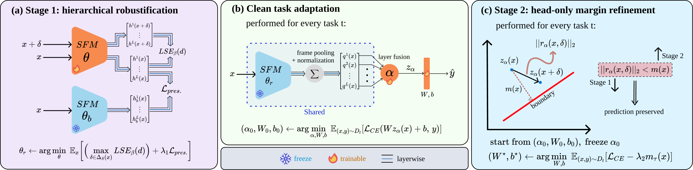

# Transferable Adversarial Robustness for Speech Foundation Models via Hierarchical Stabilization

Official PyTorch implementation of **"Transferable Adversarial Robustness for Speech Foundation Models via Hierarchical Stabilization"** (submitted to ICASSP 2027).

> **Authors:** Aref Mousavi, Shahab Sherafat\*, Kiarash Kiani Feriz\*, Amirparsa Safari\*, Raoof Zare Moayedi, Mohammad Hossein Rohban, Mohammad Sabokrou  
> \* Equal contribution.

**Paper:** [arXiv](https://arxiv.org/pdf/2610.05310)

<p align="center">
  
</p>


## 📖 Abstract

> Frozen speech foundation models (SFMs) make downstream adaptation efficient: the backbone can stay fixed while a task learns layer fusion and a lightweight classifier. Full adversarial fine-tuning is a standard route to robustness, but generating adversarial examples and updating the backbone for every task sacrifices that efficiency. We ask whether robustness can instead be learned before future tasks are known. For a frozen backbone and linear classifier, robustness can be understood through the interaction between representation stability and decision-boundary margin. This leads directly to our design: we stabilize representations across the hidden layers, rather than only the final layer, while preserving clean representations; after clean adaptation selects the layer mixture, we keep it fixed and enlarge only the classifier margin, without downstream adversarial examples. We evaluate Wav2Vec2, HuBERT, and WavLM Large on four tasks under adaptive 30 dB attacks. Across 12 backbone–task pairs, hierarchical robustification improves robust accuracy by 46.4 pp, while margin refinement adds 4.0 pp for 1.1 pp of clean accuracy.


## 🧩 Method

Our framework first robustifies the backbone before downstream tasks are known, then performs clean task adaptation and classifier-margin refinement:

- **Stage 1 — Hierarchical Robustification:** robustifies the speech foundation model before downstream tasks are known by stabilizing representations across all Transformer-block outputs under adversarial perturbations, while anchoring clean representations to the pretrained backbone.
- **Clean Task Adaptation:** freezes the robustified backbone and learns a task-specific convex layer fusion together with a linear classifier using clean labels only.
- **Stage 2 — Head-Only Margin Refinement:** freezes both the backbone and learned layer fusion, then refines only the classifier using a normalized geometric-margin objective. No downstream adversarial examples are used.

The method is motivated by the movement–margin condition

```math
\|r_\alpha(x,\delta)\|_2 < m(x),
```

where $r_\alpha(x,\delta)$ is the attack-induced movement of the fused representation and $m(x)$ is the Euclidean distance to the nearest classifier decision boundary. Stage 1 reduces this movement, while Stage 2 enlarges the classifier margin.


## ⚙️ Setup

Clone the repository:

```bash
git clone https://github.com/arefmousavi/hierarchical-robust-sfm.git
cd hierarchical-robust-sfm
```

Create a Python environment:

```bash
conda create -n hierarchical-sfm python=3.9
conda activate hierarchical-sfm
```

Install PyTorch and the remaining dependencies:

```bash
conda install pytorch==2.1.0 torchvision==0.16.0 torchaudio==2.1.0 \
  pytorch-cuda=11.8 -c pytorch -c nvidia
pip install -r requirements.txt
```

Adjust the PyTorch/CUDA installation to match your system if needed. The repository uses `torchaudio` for waveform loading and resampling. Because Common Voice releases may use compressed audio, ensure that your `torchaudio` installation has a backend capable of decoding the downloaded audio format (for example, FFmpeg).


## 🤖 Models

Select the backbone in [`config/foundation.yaml`](config/foundation.yaml):

```yaml
model:
  selected: "wavlm"  # wav2vec2 | hubert | wavlm
```

The implementation uses the following Hugging Face checkpoints for the three backbones evaluated in the paper:

| Backbone | Hugging Face checkpoint |
|---|---|
| Wav2Vec2 Large | `facebook/wav2vec2-large` |
| HuBERT Large | `facebook/hubert-large-ll60k` |
| WavLM Large | `microsoft/wavlm-large` |

By default, the selected model is loaded from Hugging Face. To use a local `from_pretrained` directory instead, set the corresponding `local_path` in `config/foundation.yaml`.


## 📁 Data Preparation

The experiments use **Common Voice** for task-independent Stage 1 robustification and four downstream speech-classification datasets.

| Role | Dataset | Config |
|---|---|---|
| Stage 1 | [Common Voice](https://commonvoice.mozilla.org/en/datasets) | [`config/foundation.yaml`](config/foundation.yaml) |
| Keyword Spotting (KS) | [Speech Commands v0.02](https://www.tensorflow.org/datasets/catalog/speech_commands) | [`config/ks.yaml`](config/ks.yaml) |
| Intent Classification (IC) | [Fluent Speech Commands](https://fluent.ai/fluent-speech-commands-a-dataset-for-spoken-language-understanding-research/) | [`config/ic.yaml`](config/ic.yaml) |
| Speaker Identification (SID) | [VoxCeleb1](https://www.robots.ox.ac.uk/~vgg/data/voxceleb/vox1.html) | [`config/sid.yaml`](config/sid.yaml) |
| Emotion Recognition (ER) | [IEMOCAP](https://sail.usc.edu/iemocap/) | [`config/er.yaml`](config/er.yaml) |

Set the corresponding `data.root` before running each experiment.

### Stage 1 manifests

Stage 1 expects three tab-separated Common Voice manifests, each containing a `path` column:

```text
/path/to/common_voice_manifests/
├── D_train.tsv
├── D_tune.tsv
└── D_U_prime.tsv
```

Configure them in `config/foundation.yaml`:

```yaml
data:
  root: "/path/to/common_voice"
  train_manifest: "/path/to/common_voice_manifests/D_train.tsv"
  val_manifest: "/path/to/common_voice_manifests/D_tune.tsv"
  sigma_manifest: "/path/to/common_voice_manifests/D_U_prime.tsv"
```

For the paper protocol, `D_train.tsv` contains the 100 h unlabeled robustification set, `D_tune.tsv` is used to monitor clean preservation during Stage 1, and the disjoint `D_U_prime.tsv` split is used to estimate the fixed layer scales. The default Stage 1 loader uses 16 kHz audio and caps utterances at 10s, as specified in `config/foundation.yaml`.

### Downstream protocols

- **Speech Commands:** official v0.02 train/validation/test split with 12 classes: 10 target commands plus `unknown` and `silence`; `unknown` and `silence` are each balanced to 10% of the wanted-word count.
- **Fluent Speech Commands:** official train/validation/test CSV splits; utterances are capped at 15s by the default configuration.
- **VoxCeleb1:** official `iden_split.txt`; training utterances longer than 10s are discarded, while validation and test utterances remain full length.
- **IEMOCAP:** four classes (`angry`, `happy/excited`, `sad`, `neutral`) with five-session leave-one-session-out evaluation. For each fold, 10% of the non-held-out utterances are used for validation with the configured deterministic seed, utterances are capped at 10s, and the runner reports the unweighted mean across the five fold-level accuracies.


## 🚀 Stage 1: Hierarchical Robustification

Choose the backbone and dataset paths in [`config/foundation.yaml`](config/foundation.yaml), then run:

```bash
python run_foundation_robustify.py --config config/foundation.yaml
```

On the first run, the fixed layer scales are estimated from `D_U_prime.tsv` and cached under:

```text
artifacts/foundation/sigma_<model>.pt
```

The final robustified backbone is saved to:

```text
outputs/foundation/<model>/theta_r/
```

The default configuration follows the paper setup: **3 epochs**, **10-step PGD at 30 dB SNR**, `beta = 30`, `lambda_1 = 0.2`, and a peak learning rate of `5e-5` with 10% linear warm-up and linear decay.

For example, to resume a WavLM Stage 1 run from the first epoch checkpoint:

```bash
python run_foundation_robustify.py \
  --config config/foundation.yaml \
  --resume outputs/foundation/wavlm/checkpoint-epoch-1
```


## 🎯 Stage 2: Head-Only Margin Refinement

The downstream runner first performs the paper's **clean task-adaptation** step—learning the convex layer-fusion weights and linear classifier while keeping the robustified backbone frozen—and then performs **Stage 2**, which freezes the learned fusion and updates only the classifier.

Set `foundation_model` in the task YAML to match the backbone robustified in Stage 1:

```yaml
foundation_model: "wavlm"  # wav2vec2 | hubert | wavlm
foundation_checkpoint: "outputs/foundation/{model}/theta_r"
```

Run a downstream task with:

```bash
# Keyword spotting
python run_downstream_adaptation.py --config config/ks.yaml

# Intent classification
python run_downstream_adaptation.py --config config/ic.yaml

# Speaker identification
python run_downstream_adaptation.py --config config/sid.yaml

# Emotion recognition: runs all five IEMOCAP LOSO folds
python run_downstream_adaptation.py --config config/er.yaml
```

The default Stage 2 settings are `lambda_2 = 2`, `tau = 0.1`, **50 epochs**, and a peak learning rate of `1e-3` with 10% linear warm-up and linear decay. Stage 2 uses only clean downstream data; checkpoint selection is performed on held-out clean validation data under the configured clean-accuracy constraint.


## 🛡️ Adversarial Evaluation

Evaluation is controlled from each downstream YAML:

```yaml
evaluation:
  clean: true
  adversarial:
    enabled: true
    phases: ["clean_adapted", "margin_refined"]
    target_snr: 30.0
    steps: 50
    restarts: 2
```

The paper evaluation uses four white-box attacks:

- **AutoPGD-CE**;
- **normalized-margin attack**;
- **fused-representation-displacement attack**;
- **psychoacoustically shaped attack**.

All attacks differentiate through preprocessing, pooling, learned layer fusion, and the classifier. The default evaluation uses **30 dB SNR**, **50 steps**, and **2 restarts**. Robust accuracy is computed using the **per-example union** of the attack pool: an example is counted as robust only if it remains correctly classified under every enabled attack.

The evaluator also records achieved-SNR and perturbation-radius diagnostics for each attack.


## 📊 Outputs

Stage 1 outputs are stored under:

```text
outputs/foundation/<model>/
├── checkpoint-epoch-1/
├── checkpoint-epoch-2/
├── checkpoint-epoch-3/
├── history.json
├── run_config.json
└── theta_r/
```

For KS, IC, and SID, downstream runs are stored under:

```text
outputs/downstream/<task>/<backbone>-<checkpoint-id>-seed<seed>/
```

A downstream run contains, among other files:

```text
clean_adapted_checkpoint.pt
final_robust_downstream_model.pt
metrics.json
mu.pt
run_config.json
```

When adversarial evaluation is enabled, the run also stores phase-specific adversarial metrics and the per-attack robustness masks used to form the per-example union.

For IEMOCAP, each held-out session is stored under a separate fold directory, and the five-fold aggregate is written to `loso_summary.json`.


## ⚙️ Main Paper Settings

| Component | Setting |
|---|---|
| Stage 1 data | 100 h Common Voice, unlabeled |
| Stage 1 threat | 30 dB L2-SNR |
| Stage 1 inner attack | PGD, 10 steps |
| Stage 1 aggregation | `beta = 30` |
| Preservation weight | `lambda_1 = 0.2` |
| Stage 1 epochs / peak LR | 3 / `5e-5` |
| Stage 2 | `lambda_2 = 2`, `tau = 0.1` |
| Stage 2 epochs / peak LR | 50 / `1e-3` |
| Robust evaluation | 30 dB, 50 steps, 2 restarts |

All experiment settings are exposed in the YAML files under [`config/`](config/).


## 📝 Citation

If you find our code or method useful in your research, please consider citing our paper:

```bibtex
@misc{mousavi2026transferable,
  title         = {Transferable Adversarial Robustness for Speech Foundation Models via Hierarchical Stabilization},
  author        = {Aref Mousavi and Shahab Sherafat and Kiarash Kiani Feriz and Amirparsa Safari and Raoof Zare Moayedi and Mohammad Hossein Rohban and Mohammad Sabokrou},
  year          = {2026},
  eprint        = {2610.05310},
  archivePrefix = {arXiv},
  primaryClass  = {eess.AS},
  url           = {https://arxiv.org/abs/2610.05310}
}
```
